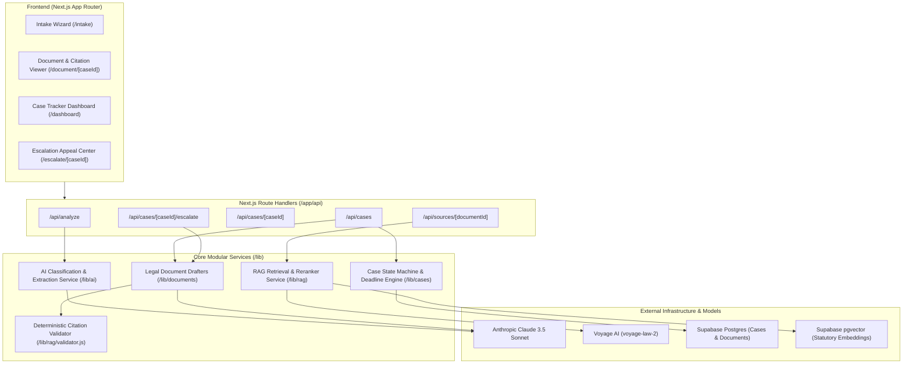
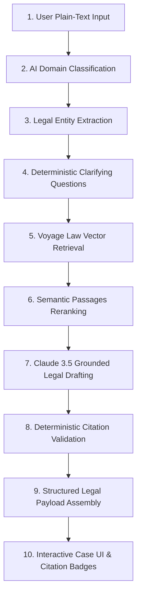

# RightsTrack

[](https://github.com/sameerONgit-debug/rightstrack/actions/workflows/ci.yml)
[](LICENSE)
[-black)](https://nextjs.org/)
[](https://supabase.com/)
[](https://vercel.com/)

> **Describe your problem once — get the right legal document, and never miss a deadline again.**

---

## 1. Problem

Over 6 million Right to Information (RTI) applications and 500,000 consumer complaints are drafted in India each year. Despite strong statutory protections under the RTI Act (2005) and Consumer Protection Act (2019), more than 40% of citizens abandon their claims when public authorities or corporations fail to respond in time. 

Current civic-tech and legal-AI solutions operate solely as static document generators: they produce an initial form or letter and terminate their engagement. The citizen is left unassisted when statutory deadlines pass, unaware of legal concepts such as *deemed refusal*, and unable to navigate the procedural complexities of drafting First Appeals or regulatory escalations.

---

## 2. Solution

RightsTrack is an end-to-end civic case tracker that bridges the gap between document creation and statutory enforcement:

```
Conversational Intake ──> AI Domain Classification ──> Citation-Grounded Drafting
                                                                │
  Auto-Escalated First Appeal <── Rule-Based Deadline Engine <──┘
```

1. **Conversational Intake**: Citizens express their problem narrative in plain text without needing prior legal knowledge.
2. **Domain Classification**: Automatic categorization into the relevant legal regime (RTI vs. Consumer Protection) with explicit user confirmation.
3. **Citation-Grounded Drafting**: Generates formal, procedural legal documents containing verified statutory citations.
4. **Case & Deadline Tracker**: Automatically calculates and tracks mandatory statutory response windows (e.g., 30 calendar days for RTI PIO responses) using deterministic date arithmetic.
5. **Automated Escalation**: When a public authority fails to respond within the legal timeframe, RightsTrack identifies the statutory breach (*deemed refusal*) and automatically pre-drafts a formal First Appeal.

---

## 3. Features

- **Free-Text Problem Intake**: Conversational entry point accepting unstructured user narratives.
- **Domain Classification with User Confirmation**: AI-assisted statutory categorization with human-in-the-loop review.
- **RAG-Grounded Generation with Visible Citations**: In-line statutory badges linking directly to verified legal sections.
- **Anti-Hallucination Citation Verification**: Deterministic post-generation validation ensuring only retrieved legal authorities are cited.
- **Rule-Based Legal Deadline Engine**: 100% deterministic calculation of statutory reply windows (no LLM date math).
- **Automated Escalation Drafting**: Pre-drafted First Appeals and notices generated immediately upon statutory deadline breach.
- **Deployed Live Demo**: Single Next.js deployment hosted on Vercel backed by Supabase Postgres and pgvector.

---

## 4. Architecture



---

## 5. Tech Stack

| Layer | Technology | Selection Rationale |
|---|---|---|
| **Fullstack Framework** | Next.js 14 (App Router, JavaScript) | Single-deployment architecture; server components and API routes in one codebase. |
| **Styling & Design** | Tailwind CSS | Utility-first styling with custom legal and civic color tokens. |
| **Database** | Supabase Postgres | Managed relational database with built-in connection pooling and row-level security. |
| **Vector Store** | Supabase pgvector | Co-located relational and vector store inside the same Postgres instance. |
| **LLM Inference** | Anthropic Claude 3.5 Sonnet | High-accuracy instruction-following for structured legal drafting and entity extraction. |
| **Embeddings** | Voyage AI (`voyage-law-2`) | Specialized domain-trained legal embedding model for statutory retrieval. |
| **Authentication** | Supabase Auth | Session-based anonymous and authenticated user state. |
| **Deployment & CI** | Vercel & GitHub Actions | Zero-config continuous deployment with automated build and lint checks. |

---

## 6. Screenshots

### Conversational Intake & Domain Classification

*Figure 1: Citizen enters problem narrative in natural language and receives AI domain classification.*

### Citation-Grounded Legal Document Drafting

*Figure 2: Grounded legal draft displaying interactive, verified statutory citation badges.*

### Real-Time Case Dashboard & Statutory Countdown

*Figure 3: Active case monitoring with deterministic statutory countdown timers.*

### Automated Deemed Refusal Escalation Draft

*Figure 4: Automated First Appeal generation triggered immediately upon deadline breach.*

---

## 7. Installation

```bash
# Clone the repository
git clone https://github.com/sameerONgit-debug/rightstrack.git
cd rightstrack

# Install project dependencies
npm install

# Configure environment variables
cp .env.example .env.local
```

---

## 8. Environment Variables

| Variable Name | Required | Description |
|---|---|---|
| `DATABASE_URL` | Yes | Supabase PostgreSQL direct connection string. |
| `NEXT_PUBLIC_SUPABASE_URL` | Yes | Supabase project API URL. |
| `NEXT_PUBLIC_SUPABASE_ANON_KEY` | Yes | Supabase anonymous client key. |
| `SUPABASE_SERVICE_ROLE_KEY` | Yes | Supabase service role secret key for backend tasks. |
| `VECTOR_DB_URL` | Yes | Supabase pgvector connection endpoint. |
| `ANTHROPIC_API_KEY` | Yes | Anthropic API key for Claude 3.5 Sonnet inference. |
| `VOYAGE_API_KEY` | Yes | Voyage AI API key for legal text embeddings. |
| `JWT_SECRET` | Yes | Secret used for session state signing. |
| `NEXT_PUBLIC_APP_URL` | Optional | Base URL for absolute link generation (default: `http://localhost:3000`). |

---

## 9. Running Locally

```bash
# Seed demo cases for hackathon testing
npm run seed

# Ingest statutory knowledge base into pgvector
npm run ingest

# Start local development server
npm run dev
```

Open [http://localhost:3000](http://localhost:3000) in your browser.

---

## 10. API Documentation

### 1. `POST /api/analyze`
Classifies a plain-text problem narrative and identifies legal entities.
- **Request Body**:
  ```json
  {
    "narrative": "I applied for a certified copy of a municipal tender 45 days ago with no reply.",
    "language": "en"
  }
  ```
- **Response (200 OK)**:
  ```json
  {
    "success": true,
    "data": {
      "domain": "RTI",
      "confidence": 0.96,
      "rationale": "Involves public authority records under RTI Act 2005.",
      "entities": {
        "applicant_name": null,
        "opposite_party": "Municipal Authority",
        "relief_sought": "Certified copies of tender documents"
      },
      "clarifications": [
        { "id": "dept", "question": "Which municipal department was addressed?", "required": true }
      ]
    },
    "error": null
  }
  ```

### 2. `POST /api/cases`
Creates a tracked case record and triggers citation-grounded drafting.
- **Request Body**:
  ```json
  {
    "domain": "RTI",
    "narrative": "Seeking municipal road repair budget records for Ward 42.",
    "entities": { "applicant_name": "Aarav Sharma", "public_authority": "DDA" }
  }
  ```
- **Response (201 Created)**:
  ```json
  {
    "success": true,
    "data": {
      "case_id": "rt-8f92-411a",
      "status": "READY_TO_FILE",
      "domain": "RTI",
      "document": {
        "id": "doc-a19e-9901",
        "content": "BEFORE THE PUBLIC INFORMATION OFFICER...",
        "citations": [{ "id": "RTI-SEC-6(1)", "verified": true }]
      },
      "deadline": { "days_statutory": 30, "status": "PENDING_FILING" }
    },
    "error": null
  }
  ```

### 3. `GET /api/cases`
Retrieves all tracked cases for the active session.
- **Response (200 OK)**:
  ```json
  {
    "success": true,
    "data": {
      "cases": [
        {
          "case_id": "rt-8f92-411a",
          "domain": "RTI",
          "title": "DDA Road Repair RTI",
          "status": "FILED",
          "days_remaining": 13,
          "is_breached": false
        }
      ],
      "total": 1
    },
    "error": null
  }
  ```

### 4. `GET /api/cases/:caseId`
Retrieves single case profile, timeline history, and document references.

### 5. `PATCH /api/cases/:caseId`
Updates case status (recording filing date, acknowledgement numbers, or resolution).
- **Request Body**:
  ```json
  {
    "status": "FILED",
    "filing_date": "2026-08-22T00:00:00.000Z",
    "acknowledgement_number": "DDA/RTI/2026/0912"
  }
  ```

### 6. `POST /api/cases/:caseId/escalate`
Generates a First Appeal or Notice of Non-Compliance when statutory deadlines breach.
- **Response (200 OK)**:
  ```json
  {
    "success": true,
    "data": {
      "case_id": "rt-8f92-411a",
      "escalation_id": "esc-1092-bb81",
      "type": "RTI_FIRST_APPEAL",
      "appeal_document": {
        "id": "doc-esc-3312",
        "content": "BEFORE THE FIRST APPELLATE AUTHORITY...\n\nMemorandum of First Appeal under Section 19(1)..."
      }
    },
    "error": null
  }
  ```

### 7. `GET /api/sources/:documentId`
Returns verified statutory source chunks and authorities cited in a generated document.

---

## 11. AI/RAG Architecture



### Anti-Hallucination Design
Legal empowerment tools must uphold rigorous accuracy standards. RightsTrack enforces an anti-hallucination guarantee through a strict post-generation code validation layer (`lib/rag/validator.js`) rather than relying on prompt instructions alone. When Claude drafts a document, citations are embedded using formal tokens (e.g., `[RTI-SEC-6(1)]`). Before the document payload is returned to the user, an AST/regex parser extracts every cited section key and verifies it against the exact set of chunk identifiers retrieved from the pgvector database for that request. Any unverified citation is stripped or causes the draft to fail closed, ensuring no invented statutes or non-existent section numbers ever reach the citizen.

---

## 12. Team

- **Frontend & UX Lead**: [Name / GitHub Handle] — Next.js App Router, responsive design, state management, citation inspection UI.
- **Backend & Database Lead**: [Name / GitHub Handle] — Next.js Route Handlers, Supabase PostgreSQL, pgvector integration, deterministic date engine.
- **AI & Legal Intelligence Lead**: [Name / GitHub Handle] — Claude 3.5 prompt pipelines, Voyage AI embeddings, knowledge base ingestion, anti-hallucination validation.

---

## 13. Live Demo & Media

- **Live Application**: [https://rightstrack.vercel.app](https://rightstrack.vercel.app) *(Deployment Link)*
- **Demo Video Walkthrough**: [https://youtube.com/watch?v=placeholder](https://youtube.com/watch?v=placeholder) *(3-Minute Presentation)*

---

## 14. Future Scope

- **Multilingual Support**: Real-time translation and dual-language legal document generation in Hindi and regional Indian languages.
- **Extended Legal Domains**: Support for municipal grievances (Public Grievance Portal), labor disputes, and tenancy matters.
- **E-Filing Integration & PDF Export**: Direct integration with RTI Online (rtionline.gov.in) and E-Daakhil consumer portals, with standardized PDF/A formatting.
- **Automated Communication Reminders**: WhatsApp and SMS notifications alerting citizens 7 days and 2 days prior to statutory deadline expiration.

---

## 15. Repository & Branching Standards

`main` is the primary protected branch. All feature development must occur on short-lived branches (`feature/*` or `fix/*`) and be merged via pull requests adhering to our [PR Template](.github/pull_request_template.md).
